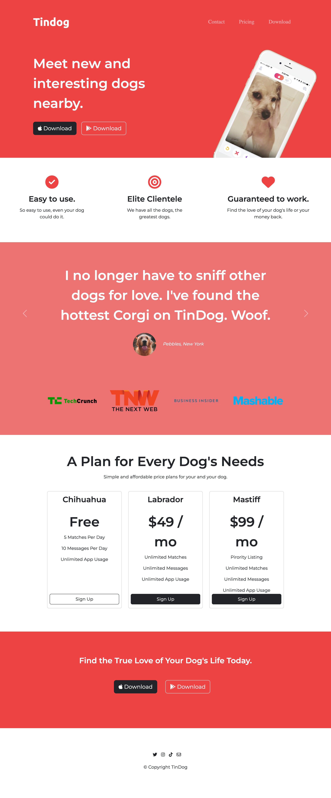

# Tindog - Landing page for dogs to find love

Tindog is a landing page for advertising an app for your dog to find its match. This is a project that is part of a Web Development Bootcamp made by Angela Yu. I developed Tindog to learn about the Bootstrap framework and compare it with Tailwindcss, a framework used on another Tindog project.



## Check out Tindog [here](https://carolanikolic.github.io/tindog-bootstrap/)

### Development Process

- The images and ‘skeleton’ project was already offered by the Bootcamp creator;
- The development of this project follows a desktop-first perspective, however, it's the interface is completely responsive.

### Built with

- Semantic HTML5 markup;
- Bootstrap framework.

### Technologies and Tools

- [HTML](https://html.com)
- [CSS](https://www.w3.org/Style/CSS/Overview.en.html)
- [Bootstrap](https://getbootstrap.com/)

### Requirements

To work with the code, before you begin, you will need to install your machine Git and have a source-code editor such as VSCode.

### What I learned

- Bootstrap components such as navbar, toggler, and carousel;
- Flexbox with Bootstrap classes;
- Use of other Bootstrap classes for styling buttons, backgrounds, padding, and margins to cite a few;
- Reinforced the knowledge on combining selectors, selectors priority and code refactor best practices.

#### Snippet for carousel
 ```
 <section id="testimonials" class="colored-sec">

    <div id="testimonials-carousel" class="carousel slide" data-bs-ride="false">
        <div class="carousel-inner">
          <div class="carousel-item active sections-padding">
            <h2>I no longer have to sniff other dogs for love. I've found the hottest Corgi on TinDog. Woof.</h2>
            
            <em>Pebbles, New York</em>
          </div>

          <div class="carousel-item sections-padding">
            <h2 class="testimonial-text">My dog used to be so lonely, but with TinDog's help, they've found the love of their life. I think.</h2>
            
            <em>Beverly, Illinois</em>
          </div>
        </div>

        <button class="carousel-control-prev" type="button" data-bs-target="#testimonials-carousel" data-bs-slide="prev">
          <span class="carousel-control-prev-icon"></span>
        </button>
        <button class="carousel-control-next" type="button" data-bs-target="#testimonials-carousel" data-bs-slide="next">
          <span class="carousel-control-next-icon"></span>
        </button>
    </div>

  </section>
 ```

### Useful resources
- [What Are the Pros and Cons of Using Bootstrap in Web Development?](https://bootstrapcreative.com/pros-cons-using-bootstrap-web-development/)
<p>This article gives an overview of the positive and negative sides of using Bootstrap as a framework for your projects. I recommend reading it if you are trying out different frameworks. That way you can have an idea of what is the opinion out there and by testing it out have your own say on the subject.<p>

### Acknowledgments
This is a project that is part of The Complete 2023 Web Development Bootstrap by Angela Yu.

### Made with :heart: by [Caroline Almeida Nikolic](https://www.linkedin.com/in/carolinealmeidanikolic/)
